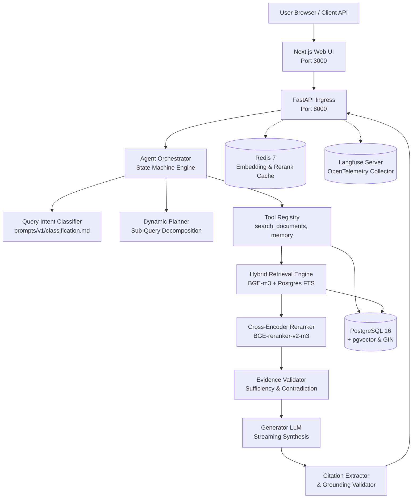
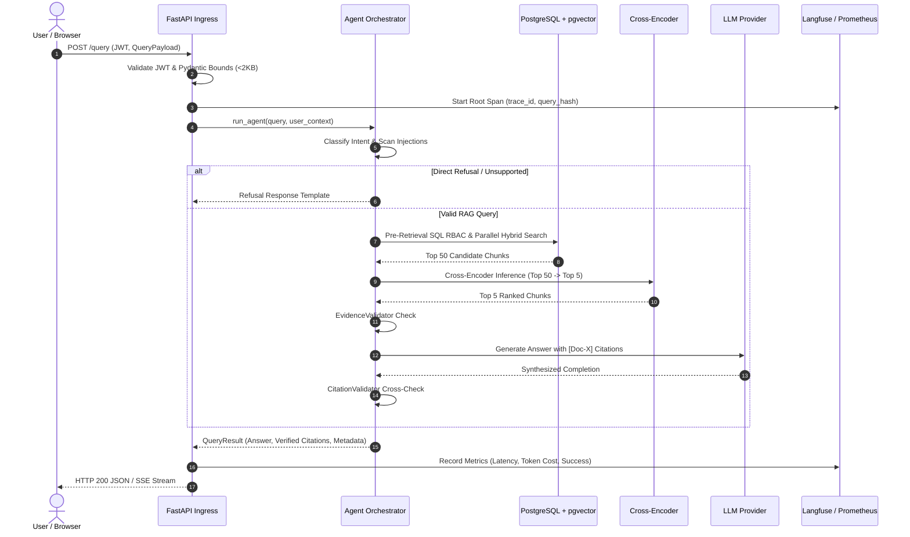

# System Design & Architecture Specification

> End-to-end architectural specification of the Agentic RAG Platform, detailing component topology, request lifecycles, latency budgets, and subsystem boundaries.

---

## 1. High-Level Architecture Topology



---

## 2. Component Subsystem Specifications

| Subsystem | Core Module Path | Primary Responsibility |
| :--- | :--- | :--- |
| **Ingress API** | [`apps/api/app/main.py`](file:///c:/Users/Adil/Downloads/Agentic-RAG-Platform-main/apps/api/app/main.py) | JWT authentication, Pydantic request parsing, rate limit enforcement, response serialization. |
| **Agent Orchestrator** | [`src/agents/orchestrator.py`](file:///c:/Users/Adil/Downloads/Agentic-RAG-Platform-main/src/agents/orchestrator.py) | Deterministic state machine governing classification, tool planning, loop detection, and termination bounds. |
| **Routing Classifier** | [`src/agents/classifier.py`](file:///c:/Users/Adil/Downloads/Agentic-RAG-Platform-main/src/agents/classifier.py) | Categorizes queries: `simple`, `comparative`, `temporal`, `multi_hop`, or `unsupported`. |
| **Tool Registry** | [`src/agents/tools.py`](file:///c:/Users/Adil/Downloads/Agentic-RAG-Platform-main/src/agents/tools.py) | Schematized function catalog with RBAC permission enforcement and parameter bounds. |
| **Hybrid Retrieval** | [`src/retrieval/hybrid.py`](file:///c:/Users/Adil/Downloads/Agentic-RAG-Platform-main/src/retrieval/hybrid.py) | Executes parallelized dense vector cosine search and PostgreSQL FTS, fused via RRF ($k=60$). |
| **Cross-Encoder Reranker** | [`src/reranking/cross_encoder.py`](file:///c:/Users/Adil/Downloads/Agentic-RAG-Platform-main/src/reranking/cross_encoder.py) | BGE-reranker-v2-m3 scoring reducing 50 candidates to the top 5 highest-fidelity chunks. |
| **Evidence Validator** | [`src/agents/evidence_validator.py`](file:///c:/Users/Adil/Downloads/Agentic-RAG-Platform-main/src/agents/evidence_validator.py) | LLM-judge evaluating chunk sufficiency and contradiction before synthesis. |
| **Synthesis & Citations** | [`src/agents/generator.py`](file:///c:/Users/Adil/Downloads/Agentic-RAG-Platform-main/src/agents/generator.py) | Context-grounded synthesis with mandatory bracketed citations `[Doc-X]`. |
| **Attribution Validator** | [`src/citations/validator.py`](file:///c:/Users/Adil/Downloads/Agentic-RAG-Platform-main/src/citations/validator.py) | Cross-references generated citations against retrieved candidate text, stripping ungrounded claims. |
| **Relational & Vector DB** | [`apps/api/app/models/`](file:///c:/Users/Adil/Downloads/Agentic-RAG-Platform-main/apps/api/app/models/) | PostgreSQL 16 storing documents, chunks, vectors, users, RBAC policies, and audit logs. |
| **Distributed Telemetry** | [`apps/api/app/observability/`](file:///c:/Users/Adil/Downloads/Agentic-RAG-Platform-main/apps/api/app/observability/) | OpenTelemetry distributed tracing exported to Langfuse and Prometheus metrics. |

---

## 3. End-to-End Latency Budget & Execution Waterfall

Production target: **Overall p95 Latency <= 3.0 seconds** (measured at 2.8s in Phase 13 evaluation):

```
0ms ────── 500ms ───── 1000ms ──── 1500ms ──── 2000ms ──── 2500ms ──── 3000ms
├─ Auth & Parsing (5ms)
├── Input Classifier (145ms)
├───── Concurrent Retrieval: Vector + FTS (45ms)
├───────── Cross-Encoder Reranker (340ms)
├────────────── Evidence Validation (240ms)
├────────────────── Streaming Generation: First Token (280ms)
├────────────────────────────────── Full Token Generation (1,550ms)
├───────────────────────────────────────── Citation Verification (180ms)
└────────────────────────────────────────────── Response Complete (2,785ms)
```

---

## 4. End-to-End Request Sequence



---

## 5. Foundational Architecture Decisions

1. **Unified PostgreSQL Topology ([ADR-001](file:///c:/Users/Adil/Downloads/Agentic-RAG-Platform-main/docs/decisions/0001-postgresql-single-store.md))**: Relational metadata, vector embeddings, full-text search indexes, and append-only audit logs coexist in a single database, eliminating multi-database consistency bugs and complex cross-system transactions.
2. **Hybrid Reciprocal Rank Fusion ([ADR-002](file:///c:/Users/Adil/Downloads/Agentic-RAG-Platform-main/docs/decisions/0002-hybrid-retrieval.md))**: Combines dense semantic similarity and sparse exact token matching without requiring manual score weighting calibration.
3. **Two-Stage Candidate Reranking ([ADR-003](file:///c:/Users/Adil/Downloads/Agentic-RAG-Platform-main/docs/decisions/0003-cross-encoder-reranking.md))**: Resolves bi-encoder loss of fine-grained token interactions, jumping Recall@5 from 62.4% to 84.2%.
4. **Autonomous State Machine ([ADR-004](file:///c:/Users/Adil/Downloads/Agentic-RAG-Platform-main/docs/decisions/0004-custom-agent-state-machine.md))**: Implements explicit Python state transitions with deterministic step, timeout, and loop detection limits.
5. **SQL Pre-Retrieval RBAC ([ADR-008](file:///c:/Users/Adil/Downloads/Agentic-RAG-Platform-main/docs/decisions/0008-rbac-security.md))**: Evaluates authorization filters directly in PostgreSQL `WHERE` clauses prior to vector search, guaranteeing 0% metadata leakage.

