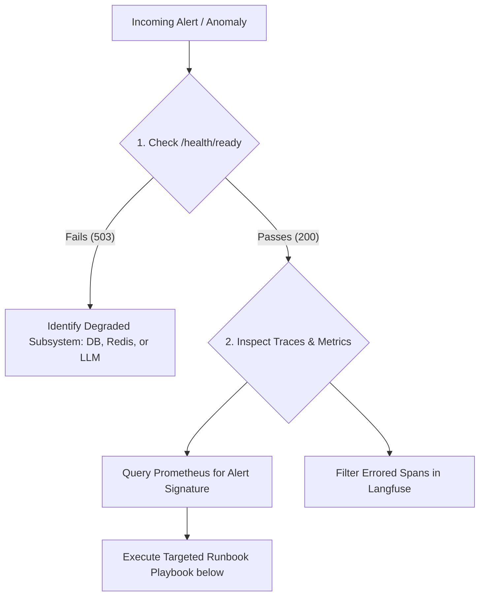

# Operations Runbook — Agentic RAG Platform

> Operational triage playbooks, incident management protocols, alert responses, and disaster recovery procedures for the Agentic RAG Platform.

---

## 1. Incident Triage Hierarchy

When alerted by Prometheus, PagerDuty, or user reports, execute triage in order:



### Fast Triage Checklist
1. **Liveness & Readiness**:
   ```bash
   curl -s http://localhost:8000/health/ready | jq .
   ```
2. **Container Status & Metrics**:
   ```bash
   docker compose ps
   docker stats --no-stream
   ```
3. **Application Logs**:
   ```bash
   docker compose logs --tail=200 -f api
   ```
4. **Prometheus Alerting State**: Inspect Prometheus at `http://localhost:9090/alerts`.

---

## 2. Alert Playbooks

### 2.1. `RAGQueryLatencyHigh` (p95 > 5.0s over 5m)

**Metric Trigger**: `histogram_quantile(0.95, sum(rate(rag_query_latency_seconds_bucket[5m])) by (le)) > 5.0`

**Root Cause Investigation**:
1. **Reranker CPU Contention**:
   - Check reranker inference latency: `rag_rerank_latency_seconds`.
   - Inspect CPU saturation on API containers (`docker stats rag-api`). If CPU > 90%, PyTorch BGE-reranker inference is bottlenecked on vCPU cores.
   - *Action*: Scale API worker replicas:
     ```bash
     docker compose up -d --scale api=3
     ```
   - Alternatively, temporarily reduce candidate rerank pool from 50 to 25 in `configs/prod/config.yaml` (`reranking.top_k_candidates: 25`).
2. **Upstream LLM Provider Degradation**:
   - Check `rag_llm_latency_seconds`. If latency is > 3.5s, the third-party LLM API (OpenAI / Anthropic) is degraded.
   - *Action*: Switch active provider fallback or toggle to a faster model tier (e.g. `gpt-4o-mini`) via environment configuration without code deploy.
3. **PostgreSQL Execution Bottlenecks**:
   - Query active connections and lock contention:
     ```sql
     SELECT pid, now() - query_start AS duration, query, state 
     FROM pg_stat_activity 
     WHERE state != 'idle' AND now() - query_start > interval '2 seconds';
     ```
   - If vector search is sequential, rebuild or analyze HNSW graph:
     ```sql
     REINDEX INDEX idx_document_chunks_embedding_hnsw;
     ANALYZE document_chunks;
     ```
4. **Cold Start Penalty**:
   - Ensure embedder and reranker models are fully loaded during startup lifecycle rather than JIT on first user request. Run:
     ```bash
     python scripts/warmup_models.py
     ```

---

### 2.2. `RAGFailureRateHigh` (Error Rate > 5% over 5m)

**Metric Trigger**: `sum(rate(rag_failure_total[5m])) / sum(rate(rag_query_total[5m])) > 0.05`

**Triage by Failure Type**:
Query Prometheus: `sum by (failure_type) (rate(rag_failure_total[5m]))`

| Failure Code | Root Cause Diagnosis | Immediate Action |
| :--- | :--- | :--- |
| `NO_DOCUMENTS` | Empty retrieval results due to restrictive RBAC or missing ingest. | Verify chunk count in DB (`SELECT count(*) FROM document_chunks;`). Check user's JWT project claims. |
| `INSUFFICIENT_EVIDENCE` | Retrieved chunks fail similarity or confidence threshold in `EvidenceValidator`. | Inspect failing queries in Langfuse. Increase `retrieval.initial_candidates` from 50 to 100 or adjust similarity threshold. |
| `LLM_TIMEOUT` | LLM provider exceeded 30s deadline or circuit breaker tripped. | Verify provider API status. Ensure exponential backoff retries (`src/core/retries.py`) are healthy. |
| `AGENT_LOOP` | Multi-hop reasoning loop detected consecutive identical tool calls. | Inspect failing trace IDs in Langfuse. The planner is receiving ambiguous evidence. Adjust planner system prompt in `prompts/v1/planning.md`. |
| `HALLUCINATION_DETECTED` | Generation output failed citation validation check against evidence chunks. | Cross-reference generator output and chunk IDs. Check if citation validator LLM threshold is excessively strict. |

---

### 2.3. PostgreSQL Service Failure

**Symptom**: `/health/ready` returns `{"database": "unhealthy"}`, HTTP 503 errors on query ingestion.

**Playbook**:
1. Check container lifecycle:
   ```bash
   docker compose ps postgres
   docker compose logs --tail=100 postgres
   ```
2. Check host storage capacity:
   ```bash
   docker compose exec postgres df -h /var/lib/postgresql/data
   ```
   *If disk is 100% full*: Vacuum dead tuples or expand volume.
3. Test connection manually:
   ```bash
   docker compose exec postgres pg_isready -U rag -d rag
   ```
4. Restart container:
   ```bash
   docker compose restart postgres
   ```
5. If table corruption occurs, initiate disaster recovery restore from latest WAL/pg_dump backup (see [`docs/operations/backup-restore.md`](file:///c:/Users/Adil/Downloads/Agentic-RAG-Platform-main/docs/operations/backup-restore.md)).

---

### 2.4. Redis Cache Outage

**Symptom**: Redis connection timeouts logged; embedding cache misses spike to 100%.

**Playbook**:
1. **Graceful Fallback**: The platform is architected with a non-blocking cache layer — if Redis is down, queries continue to execute directly against pgvector (with a slight ~50ms latency increase).
2. Check Redis container health:
   ```bash
   docker compose exec redis redis-cli ping
   ```
3. Restart Redis service:
   ```bash
   docker compose restart redis
   ```
4. Flush corrupted keyspace if OOM:
   ```bash
   docker compose exec redis redis-cli flushdb async
   ```

---

### 2.5. Langfuse & OpenTelemetry Collector Outage

**Symptom**: Trace export warnings in API container logs; Langfuse UI unreachable.

**Playbook**:
1. **Non-Blocking Telemetry**: The OpenTelemetry OTLP batch processor buffers spans in memory and drops them gracefully if endpoint is unreachable. Client queries are **never** blocked.
2. Check Langfuse service:
   ```bash
   docker compose ps langfuse
   docker compose restart langfuse
   ```
3. Verify OTLP ingestion port 3000 is open.

---

## 3. Escalation Matrix & Severity Levels

| Severity Level | Criteria | Response SLA | Action Protocol |
| :--- | :--- | :--- | :--- |
| **P0 (Critical)** | Service completely unreachable; >50% queries failing; data loss risk. | < 15 minutes | Page on-call engineer; initiate incident war room; post status update. |
| **P1 (Degraded)** | High latency (p95 > 5s); single provider failing; elevated 5xx errors (5-20%). | < 1 hour | Notify engineering team in `#eng-incidents`; triage via Prometheus & Langfuse. |
| **P2 (Minor)** | Non-blocking observability failure (Langfuse down); isolated user query edge cases. | Next business day | File GitHub Issue with trace ID and reproduction steps. |

---

## 4. Post-Incident Review Protocol

For all P0 and P1 incidents:
1. Preserve forensic logs and Prometheus graphs for the incident window.
2. Complete a blameless post-mortem document following template: `docs/operations/post-mortems/YYYY-MM-DD-incident-title.md`.
3. Track corrective action items in the project backlog (code fixes, architectural changes, or new automated tests).

