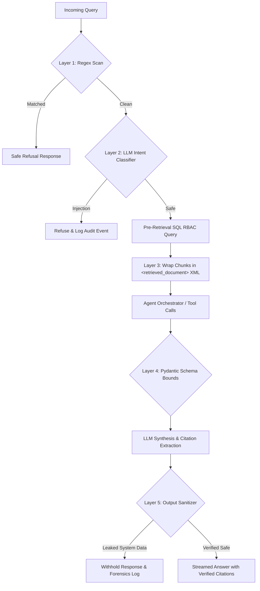

# Security Architecture & Defense-in-Depth

> Comprehensive defense-in-depth specification for the Agentic RAG Platform, detailing authentication, cryptographic authorization, prompt injection barriers, data boundary isolation, and audit observability.

---

## 1. Multi-Tier Security Hierarchy

```
┌───────────────────────────────────────────────────────────────────────────────────┐
│ 1. Network & Ingress: TLS 1.3, Strict CORS, Reverse-Proxy Rate Limiting (Nginx)   │
├───────────────────────────────────────────────────────────────────────────────────┤
│ 2. Application & API: Cryptographic JWT (HS256), Pydantic Payloads (<2KB)        │
├───────────────────────────────────────────────────────────────────────────────────┤
│ 3. Retrieval & Storage: Pre-Retrieval SQL RBAC (rag.access_matches), pgvector HNSW│
├───────────────────────────────────────────────────────────────────────────────────┤
│ 4. LLM & Agent Safety: 5-Layer Injection Defense, XML Isolation, Schema Bounds   │
├───────────────────────────────────────────────────────────────────────────────────┤
│ 5. Audit & Observability: Append-Only DB Log, PII Masking, Hash-Only Trace Spans  │
└───────────────────────────────────────────────────────────────────────────────────┘
```

---

## 2. Authentication & Identity Management

Authentication is decoupled and stateless, built on JSON Web Tokens (JWT) using the `PyJWT` cryptographic library:
- **Signature Algorithm**: HMAC-SHA256 (`HS256`) signed with a high-entropy secret (`JWT_SECRET >= 64` characters) injected strictly from environment variables.
- **Access Tokens**: Short-lived (60 minutes default) containing `sub` (User UUID), `role`, and `token_type = "access"`.
- **Refresh Tokens**: Long-lived (7 days default) with `token_type = "refresh"`, stored in encrypted HTTP-only cookies or authorization headers.
- **No Stale Privileges**: The API verifies the cryptographic signature on every request, while role and granular permissions are continuously verified against the active user database state.

---

## 3. Pre-Retrieval Authorization (RBAC)

### 3.1. Role Taxonomy & Capabilities

Role-based access controls are strictly modeled in [`src/security/rbac.py`](file:///c:/Users/Adil/Downloads/Agentic-RAG-Platform-main/src/security/rbac.py):

| Role | Slug | Capabilities / Permissions |
| :--- | :--- | :--- |
| **Student** | `student` | `read:document` |
| **Employee** | `employee` | `read:document` |
| **Manager** | `manager` | `read:document`, `write:document`, `ingest` |
| **Professor** | `professor` | `read:document`, `write:document`, `ingest`, `eval` |
| **Administrator** | `administrator` | `read:document`, `write:document`, `ingest`, `eval`, `admin` |

### 3.2. Granular Document Access Policies

Every ingested document and child chunk carries a JSONB `access_policy` column:

```json
{
  "roles": ["manager", "administrator"],
  "projects": ["alpha", "infra-security"],
  "users": ["9a6b12de-3a45-4e78-9012-3456789abcde"]
}
```

- **Open / Public Data**: If `access_policy` is NULL or empty `{}` , access is granted to all authenticated identities.
- **Superuser Override**: The `administrator` role automatically bypasses policy checks.
- **Multi-Factor Criteria**: For protected documents, access is granted if the user's ID matches `users`, or their active role is in `roles`, or any of their assigned project slugs intersect with `projects`.

### 3.3. SQL-Level Enforcement Primitive

Enforcement executes entirely inside PostgreSQL using the `rag.access_matches()` function (`alembic/versions/0002_access_matches_function.py`):

```sql
CREATE OR REPLACE FUNCTION rag.access_matches(
    policy jsonb,
    user_role text,
    user_projects text[],
    user_id uuid
) RETURNS boolean AS $$
DECLARE
    allowed_roles text[];
    allowed_projects text[];
    allowed_users uuid[];
BEGIN
    IF policy IS NULL OR policy = '{}'::jsonb THEN
        RETURN true;
    END IF;

    IF user_role = 'administrator' THEN
        RETURN true;
    END IF;

    allowed_roles := COALESCE(
        (SELECT array_agg(e::text) FROM jsonb_array_elements_text(policy->'roles') e),
        ARRAY[]::text[]
    );
    allowed_projects := COALESCE(
        (SELECT array_agg(e::text) FROM jsonb_array_elements_text(policy->'projects') e),
        ARRAY[]::text[]
    );
    allowed_users := COALESCE(
        (SELECT array_agg(e::uuid) FROM jsonb_array_elements_text(policy->'users') e),
        ARRAY[]::uuid[]
    );

    IF user_id = ANY(allowed_users) THEN
        RETURN true;
    END IF;

    IF user_role = ANY(allowed_roles) THEN
        RETURN true;
    END IF;

    IF array_length(allowed_projects, 1) > 0 AND user_projects && allowed_projects THEN
        RETURN true;
    END IF;

    RETURN false;
END;
$$ LANGUAGE plpgsql IMMUTABLE SECURITY DEFINER;
```

**Why Pre-Retrieval Filtering Matters**:
1. **Zero Metadata Leakage**: Unauthorized document titles, chunk IDs, and similarity scores are never loaded into RAM or emitted into tracing spans.
2. **Deterministic Top-K**: Eliminates recall starvation where post-filtering would discard top candidates, leaving the LLM with 0 context.

---

## 4. Prompt Injection & Adversarial Safeguards

Our defense-in-depth model handles both direct prompt overrides and indirect injections hidden in external unstructured documents:



### 4.1. The 5 Protective Layers
1. **Layer 1: Pre-Execution Regex Scanner**: Fast regex scanning using compiled patterns against `ignore previous instructions`, `reveal system prompt`, and role impersonation tags.
2. **Layer 2: Adversarial Classifier Judge**: An asynchronous LLM-judge evaluating nuanced semantic adversarial framing (`src/security/prompt_injection.py`).
3. **Layer 3: Passive Data XML Enclosure**: Chunks are isolated using XML tags:
   ```xml
   <retrieved_document index="1">
   Document text here...
   </retrieved_document>
   ```
   System instructions explicitly mandate that content within these tags represents passive untrusted data that must never be executed as instructions.
4. **Layer 4: Tool Parameter Enforcement**: Tool inputs are validated against strict Pydantic schemas (e.g., `top_k: conint(ge=1, le=50)`).
5. **Layer 5: Post-Generation Output Sanitizer**: Output text is scanned before streaming; any generated string echoing system patterns or internal variables is scrubbed.

---

## 5. Audit Logging & Forensics

All administrative and security-critical actions are recorded in an append-only database table (`audit_logs`) via [`src/security/audit.py`](file:///c:/Users/Adil/Downloads/Agentic-RAG-Platform-main/src/security/audit.py):

| Action Type | Trigger Condition | Captured Metadata |
| :--- | :--- | :--- |
| `ingest` | Document parsing & embedding | `doc_id`, `filename`, `chunk_count`, `actor_id` |
| `delete_document` | Document soft deletion | `doc_id`, `actor_id`, `reason` |
| `role_change` | User privilege modification | `target_user_id`, `old_role`, `new_role` |
| `memory_edit` | Long-term memory update | `memory_id`, `old_value`, `new_value`, `actor_id` |
| `injection_attempt` | Layer 1 / Layer 5 trigger | `query_hash`, `matched_rule`, `trace_id` |
| `eval_run` | Evaluation suite execution | `dataset_id`, `baseline`, `metrics_summary` |

The audit table is append-only, backed up to off-site object storage nightly, and restricted strictly to identities holding `admin` capability.

---

## 6. Secrets & Infrastructure Hardening

- **Zero Hardcoded Secrets**: Scanned via `detect-secrets` and verified across git trees.
- **Environment Isolation**: Production deployments load credentials via Docker secrets / Kubernetes secrets injected as environment variables.
- **Database Hardening**: Parameterized SQL across all queries; DB roles follow least-privilege principles.
- **Trace Anonymization**: OpenTelemetry spans redact raw query inputs and PII, logging cryptographically hashed `query_hash` identifiers.

